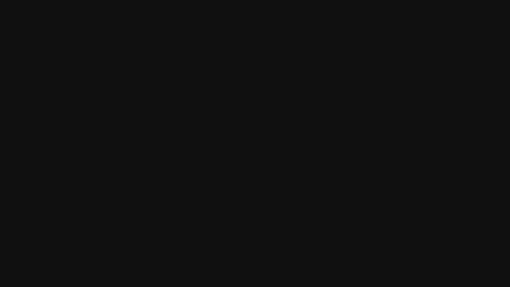
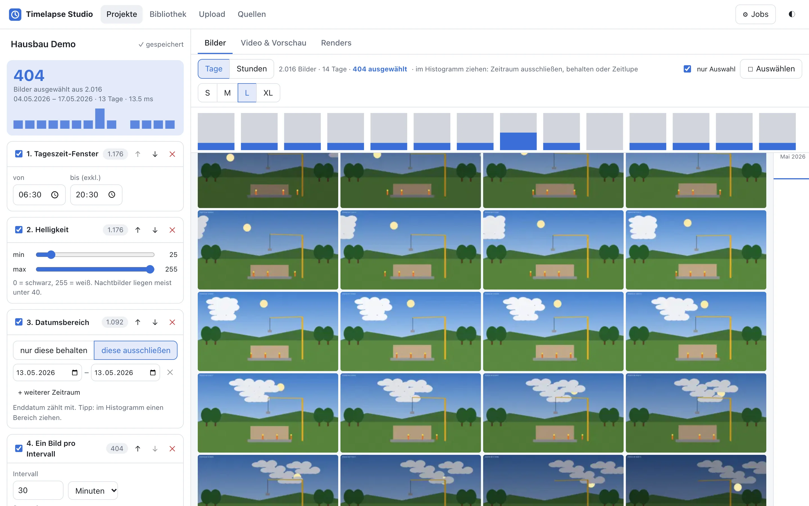
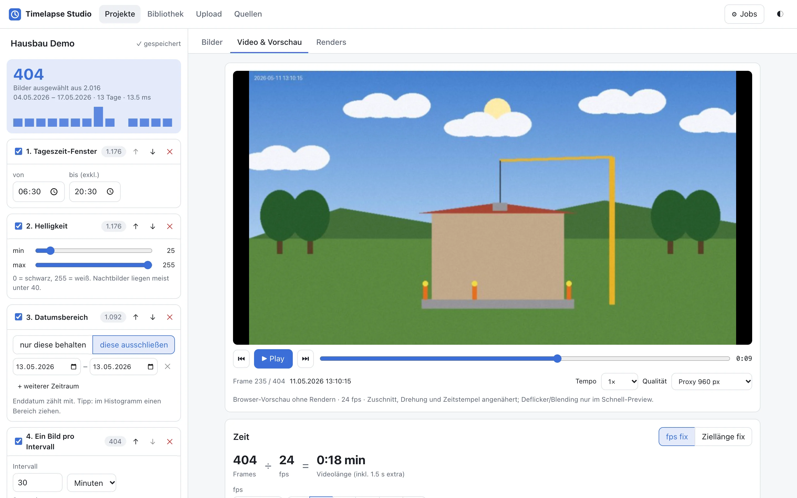
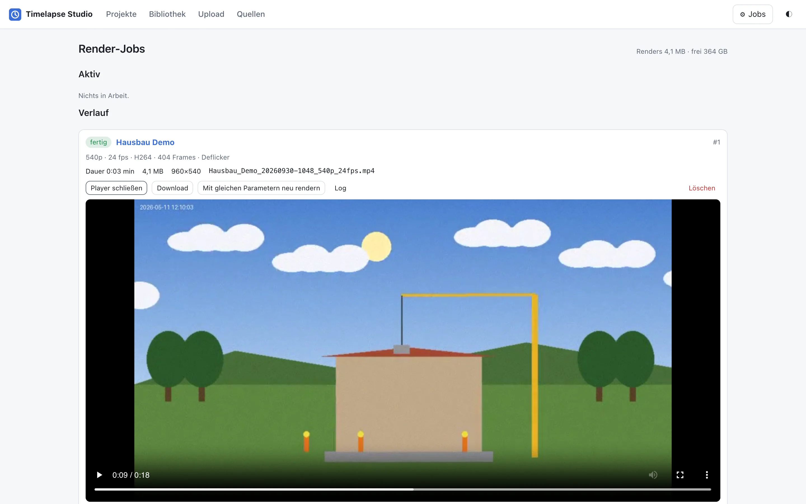
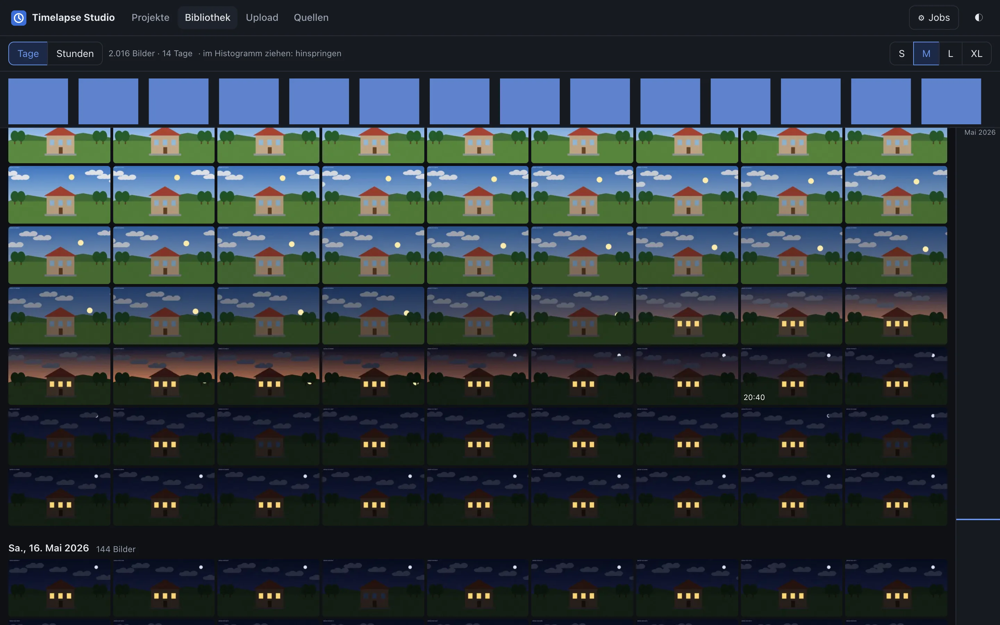
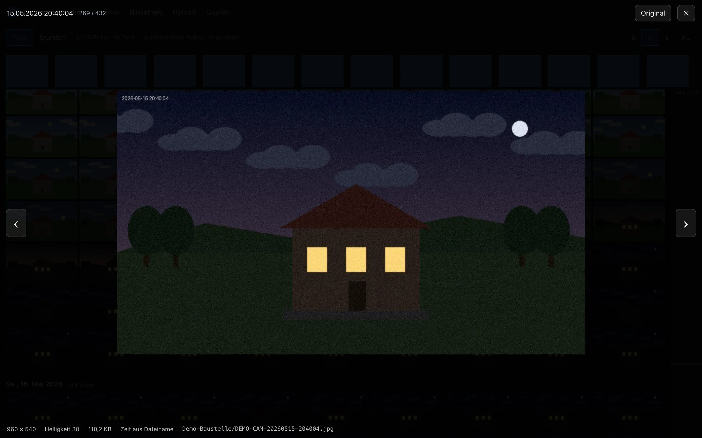
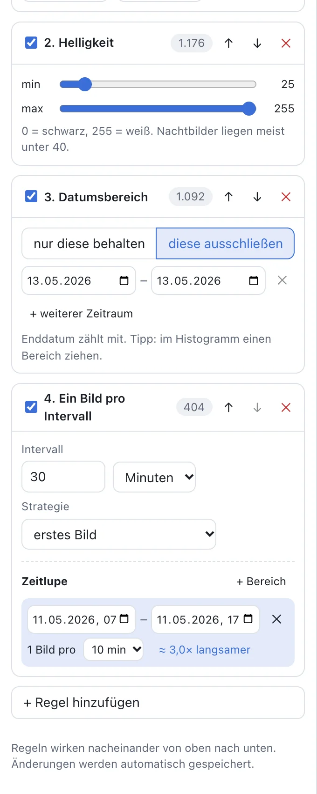
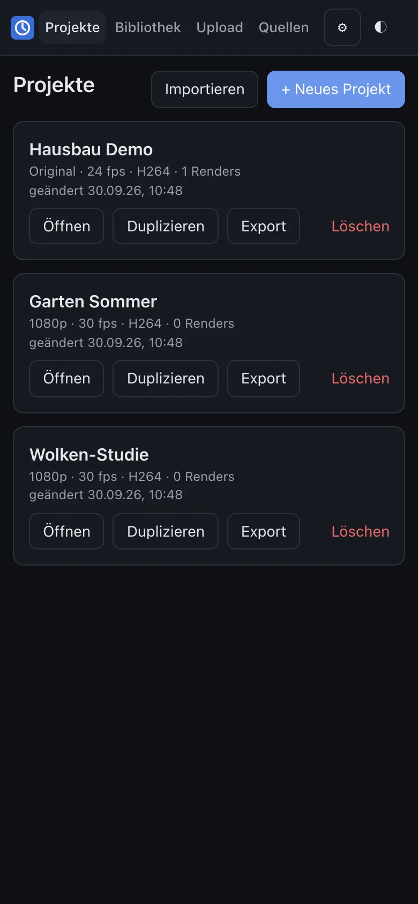
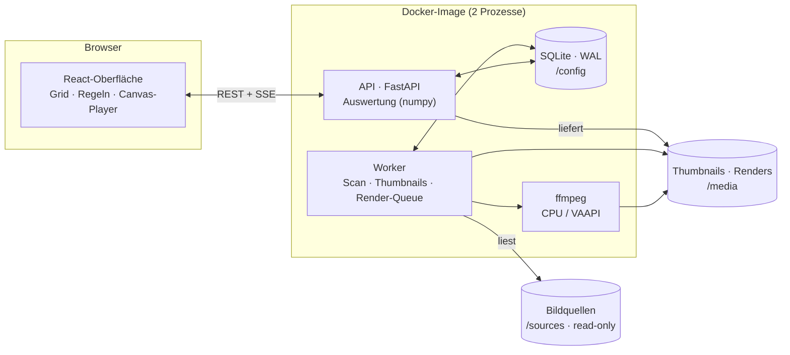

<div align="center">


# Timelapse Studio

**Aus hunderttausenden Kamera-Snapshots in wenigen Klicks ein Zeitraffer-Video – selbst gehostet.**

Bilder durchstöbern wie in Immich · Auswahl per Regeln statt per Hand · Vorschau sofort im Browser · Rendern mit ffmpeg und GPU

[](#entwicklung)
[](#architektur)
[](#architektur)
[](#rendern--hardware-beschleunigung)
[](#schnellstart)
[](#tests)

<sub>🇬🇧 A self-hosted web app that turns large photo series (security-camera snapshots, uploads) into timelapse videos — rule-based frame selection, instant in-browser preview, ffmpeg rendering with VAAPI. UI in German.</sub>



<sub>Ergebnis aus den mitgelieferten Demo-Daten: 2.016 Bilder → Regeln → 18-Sekunden-Video, inklusive Regentag ausgeschlossen und Zeitlupe am Tag des Dachs.</sub>

</div>

---

## Warum?

Eine Kamera, die alle 30 Sekunden ein Bild speichert, sammelt in einem halben Jahr **über 170.000 Fotos**. Daraus einen guten Zeitraffer zu machen, heißt bisher: Dateien sortieren, Nachtbilder aussortieren, jedes n-te Bild herauskopieren, ffmpeg-Befehle basteln, rendern, feststellen, dass es zu schnell ist – und von vorn.

Timelapse Studio macht daraus einen interaktiven Arbeitsablauf:

1. **Durchstöbern** – alle Bilder auf einer Zeitleiste, flüssig auch bei sechsstelligen Mengen
2. **Auswählen** – mit kombinierbaren Regeln statt Dateioperationen (nie destruktiv, Originale bleiben unberührt)
3. **Abstimmen** – Framezahl, fps und Videolänge rechnen sich gegenseitig live aus
4. **Ansehen** – Sofort-Vorschau im Browser, ohne zu rendern
5. **Rendern** – als Job im Hintergrund mit Fortschritt, Restzeit und Download

## Funktionen

<table>
<tr>
<td width="50%" valign="top">

**🗂 Bild-Browser**
- Zeitleisten-Grid nach Tagen, virtualisiert – flüssig bei 300k+ Bildern
- Scrubber am Rand, Aktivitäts-Histogramm (Tage/Stunden)
- Lightbox mit Metadaten, Pfeiltasten-Navigation
- Mehrfachauswahl per Klick, Shift-Klick oder Rechteck

**🧮 Auswahl-Pipeline**
- Regeln in beliebiger Reihenfolge, einzeln an/aus
- Tageszeit-Fenster (auch über Mitternacht), Wochentage, Helligkeit
- Zeiträume behalten *oder* herausschneiden
- Jedes n-te Bild, ein Bild pro Intervall (erstes / nächstes zu Uhrzeit / hellstes / Median)
- **Zeitlupen-Bereiche:** in spannenden Phasen mehr Bilder → läuft dort langsamer
- Standbilder überspringen (Bild-Hash), manuelles Ein-/Ausschließen
- Neuberechnung über 170.000 Bilder in ~0,1 s

</td>
<td width="50%" valign="top">

**🎬 Video**
- Modus „fps fix“ oder „Ziellänge fix“ mit Vorschlägen (fps anpassen, n-tes Bild, exakte Framezahl)
- Auflösung, Seitenverhältnis, Zuschnitt per Maus, Drehen/Spiegeln
- H.264 / H.265 / AV1, Qualitätsstufen oder Expertenmodus
- Deflicker, Frame-Blending, Zeitstempel-Einblendung pro Bild
- Titel, Abspann, Fades, Hintergrundmusik
- Presets zum Wiederverwenden

**⚙️ Jobs & Betrieb**
- Persistente Render-Queue, übersteht Neustarts
- Fortschritt, Dauer, Restzeit, Render-fps live per SSE
- Abbrechen in < 5 s, Schnell-Preview in 480p
- Browser- und [ntfy](https://ntfy.sh)-Benachrichtigung bei Job-Ende
- Uploads per Drag & Drop, auch ZIP, mit Fortsetzen nach Abbruch
- Dark Mode, mobil nutzbar, keine Internet-Abhängigkeiten

</td>
</tr>
</table>

## Screenshots

<table>
<tr>
<td colspan="2"><br><sub><b>Projekt-Editor</b> – links die Regel-Pipeline mit Zwischenständen pro Regel, rechts nur die ausgewählten Bilder. Im Histogramm ist die Zeitlupe am 11.05. als höherer Balken zu sehen.</sub></td>
</tr>
<tr>
<td width="50%"><br><sub><b>Sofort-Vorschau</b> im Browser mit Frame-genauem Scrubber – ohne zu rendern.</sub></td>
<td width="50%"><br><sub><b>Render-Jobs</b> mit Player, Download und „mit gleichen Parametern neu rendern“.</sub></td>
</tr>
<tr>
<td width="50%"><br><sub><b>Bibliothek</b> im Dark Mode – der Tagesablauf wird im Grid sichtbar.</sub></td>
<td width="50%"><br><sub><b>Lightbox</b> mit Aufnahmezeit, Helligkeit und Herkunft des Zeitstempels.</sub></td>
</tr>
<tr>
<td width="50%" align="center"><br><sub><b>Zeitlupe</b> direkt in der Regel – mit Anzeige, wie viel langsamer.</sub></td>
<td width="50%" align="center"><br><sub><b>Mobil</b> – Job-Status und Vorschau auch unterwegs.</sub></td>
</tr>
</table>

## Schnellstart

Voraussetzung: Docker mit Compose.

```bash
git clone https://github.com/mbay-ODW/timelapse-studio.git
cd timelapse-studio
mkdir -p data/sources/meine-kamera        # Bilder hier ablegen – jeder Unterordner wird eine Quelle
docker compose up -d --build
```

Dann **http://localhost:8080** öffnen. Die App findet die Ordner unter `data/sources/`, indexiert sie im Hintergrund und erzeugt Vorschaubilder. Unter **Projekte → Neues Projekt** geht es los.

<details>
<summary><b>Keine eigenen Bilder zur Hand? Demo-Daten erzeugen</b></summary>

Das Skript zeichnet eine Baustellen-Szene über zwei Wochen – mit Tag/Nacht, Wolken, Regentagen, Kran und beleuchteten Fenstern (≈ 2.000 Bilder, 180 MB):

```bash
pip install pillow numpy
python3 scripts/make-demo-data.py data/sources/demo-baustelle --days 14 --step 10
```

Danach unter **Quellen** auf „Scannen“ klicken oder bis zum nächsten automatischen Scan warten.
</details>

### Mounts

| Pfad im Container | Inhalt | Empfehlung |
|---|---|---|
| `/config` | SQLite-Datenbank: Index, Projekte, Regeln, Presets, Job-Queue | schneller Speicher, **ins Backup** |
| `/media` | `thumbs/` `proxies/` `uploads/` `renders/` `tmp/` | großer Speicher (Thumbnails ≈ 12 KB pro Bild) |
| `/sources/<name>` | deine Bildordner | **read-only** – die App verändert Originale nie |

Mit Compose-Variablen anpassen, z. B. in einer `.env`:

```dotenv
SOURCES_PATH=/pfad/zu/kameras      # Unterordner = Quellen
CONFIG_PATH=/ssd/timelapse
MEDIA_PATH=/hdd/timelapse
PUID=1000
PGID=1000
HTTP_PORT=8080
```

## Konfiguration

| Variable | Standard | Bedeutung |
|---|---|---|
| `TZ` | `Europe/Berlin` | Zeitzone für Dateizeiten und Anzeige |
| `HWACCEL` | `none` | `vaapi` für Intel/AMD-GPU-Encoding (siehe unten) |
| `MAX_PARALLEL_RENDERS` | `1` | gleichzeitige Render-Jobs (ein Schnell-Preview darf zusätzlich laufen) |
| `FFMPEG_THREADS` | Kerne − 1 | Threads pro ffmpeg-Prozess |
| `INDEX_WORKERS` | `8` | Prozesse für Thumbnails – auf Festplatten ist mehr als die Kernzahl sinnvoll |
| `THUMB_SIZE` / `PROXY_SIZE` | `320` / `960` | lange Kante von Thumbnail bzw. Vorschau-Proxy in Pixeln |
| `SCAN_INTERVAL_MIN` | `60` | automatischer Rescan der Quellen (`0` = aus) |
| `RENDER_WINDOW` | leer | z. B. `22:00-06:00` – finale Renders nur nachts, Vorschauen immer |
| `RENDERS_RETENTION_DAYS` | `0` | fertige Renders nach X Tagen automatisch löschen (`0` = nie) |
| `NTFY_URL` / `NTFY_TOPIC` / `NTFY_TOKEN` | leer | Push-Nachricht bei Job-Ende |
| `LOG_LEVEL` | `INFO` | Logs gehen strukturiert (JSON) auf stdout |

### Zeitstempel

Pro Quelle einstellbar, in welcher Reihenfolge die Aufnahmezeit bestimmt wird: **EXIF** → **Dateiname** → **Änderungsdatum**. Das Standardmuster erkennt gängige Kamera- und Handy-Dateinamen (`CAM-20260603-151702…`, `IMG_20260603_151702`, `2026-06-03 15.17.02` …). Eigene Muster gehen als Regex oder strftime (`cam_%d.%m.%y_%H%M*`) – mit Live-Test an echten Dateien der Quelle.

## Betrieb hinter einem Reverse-Proxy

Timelapse Studio hat **keine eigene Benutzerverwaltung**. Es ist dafür gedacht, hinter einem Reverse-Proxy mit Login zu laufen (z. B. Traefik + [Authelia](https://www.authelia.com) als ForwardAuth); den Header `Remote-User` zeigt die App an.

[`deploy/docker-compose.traefik.yml`](deploy/docker-compose.traefik.yml) ist eine vollständige Vorlage – auch als Portainer-Stack geeignet – mit Traefik-Labels, GPU-Durchreichung und Speicherlimits. Die Login-Middleware ist dort **Pflichtangabe**: ohne `TRAEFIK_MIDDLEWARES` startet der Stack bewusst nicht, damit die App nie versehentlich offen im Netz steht.

```dotenv
DOMAIN=timelapse.example.com
TRAEFIK_MIDDLEWARES=authelia@docker
TRAEFIK_CERTRESOLVER=letsencrypt
CONFIG_PATH=/srv/timelapse/config
MEDIA_PATH=/srv/timelapse/media
SOURCE_PATH=/srv/kamera/snapshots
SOURCE_NAME=garten
HWACCEL=vaapi
```

> **Tipp:** Die Oberfläche lädt Thumbnails und Vorschaubilder gebündelt (bis zu 150 Bilder pro Request). Das hält auch strenge Rate-Limits am Proxy und die Last auf dem Auth-Server gering.

## Rendern & Hardware-Beschleunigung

Gerendert wird mit ffmpeg über eine concat-Liste mit einem Eintrag pro Bild. So stimmt die **Framezahl exakt** mit der Auswahl überein, und der Zeitstempel jedes Bildes wird per Paket-Metadatum eingeblendet – auch bei gemischten Bildgrößen oder krummen Framerates wie 29,97 fps.

Mit `HWACCEL=vaapi` und durchgereichtem `/dev/dri` übernimmt die GPU das Encoding (Intel Quick Sync / AMD). Gemessen mit echten 2560×1440-Snapshots, Ausgabe 1080p:

| Encoder | Tempo | Anmerkung |
|---|---|---|
| H.264, CPU (x264) | 23 fps | Referenzqualität |
| **H.264, GPU (VAAPI)** | **77 fps** | ≈ 3× schneller |
| H.265, CPU (x265) | 7 fps | |
| **H.265, GPU (VAAPI)** | **77 fps** | ≈ 11× schneller |

<sub>Intel i7-8700 mit UHD 630. Die GPU bekommt automatisch ~1,5× Bitrate, um dieselbe Bildqualität (SSIM) wie x264 zu erreichen. AV1 läuft auf dieser GPU-Generation nur per CPU.</sub>

Die Qualitätsstufen sind gedeckeltes CRF: Zeitraffer-Material ändert sich von Bild zu Bild stark, reines CRF würde sonst 50+ Mbit/s erzeugen. „Standard“ landet bei 1080p30 bei etwa 9 Mbit/s.

## Architektur



- **Index:** ein Rescan prüft nur Pfad, Größe und Änderungszeit – 170.000 Dateien in ~15 s. Neue Bilder bekommen Thumbnail, Helligkeit und einen Bild-Hash im Hintergrund, sichtbare Bilder sofort.
- **Auswahl:** alle Regeln laufen vektorisiert in numpy auf dem gesamten Bestand. Zeiten werden als lokale Wanduhrzeit gespeichert, dadurch sind Tageszeit- und Wochentagsfilter reine Ganzzahl-Arithmetik und immun gegen Sommerzeitwechsel.
- **Jobs:** die Queue ist eine Datenbanktabelle. Der Worker streamt den Fortschritt aus `ffmpeg -progress`, Abbrechen erfolgt sauber (`q` → SIGTERM → SIGKILL), unterbrochene Jobs sind nach einem Neustart als „neu starten?“ markiert.

## Entwicklung

```bash
python3.12 -m venv .venv && .venv/bin/pip install -r backend/requirements-dev.txt
cd frontend && npm ci && cd ..

scripts/dev.sh                      # API :8080 + Worker gegen ./dev-data
npm --prefix frontend run dev       # Vite :5173 mit Proxy auf die API
```

Die interaktive API-Dokumentation liegt unter `/api/docs`.

### Tests

```bash
.venv/bin/pytest backend/tests      # Unit- und API-Tests
scripts/test-docker.sh              # alle Tests im Laufzeit-Image, inkl. echter Renders
```

Die Render-Tests erzeugen Videos und prüfen sie mit `ffprobe` auf Framezahl, Auflösung und Dauer – u. a. mit Titelkarte, Halte-Frames, gemischten Bildgrößen, Abbruch in < 5 s und Wiederaufnahme nach einem Neustart.

## Roadmap

- [x] Zeitlupen-Bereiche
- [ ] Tempo automatisch nach Aktivität im Bild (mehr Frames, wenn etwas passiert)
- [ ] Ruhige Tage automatisch überspringen
- [ ] Bildstabilisierung und Belichtungsausgleich für Tag/Nacht-Übergänge
- [ ] Mehrere Clips hintereinander mit Übergängen
- [ ] Automatisch neu rendern, wenn neue Bilder dazukommen

Anforderungen und Designentscheidungen: [`docs/requirements.md`](docs/requirements.md)
